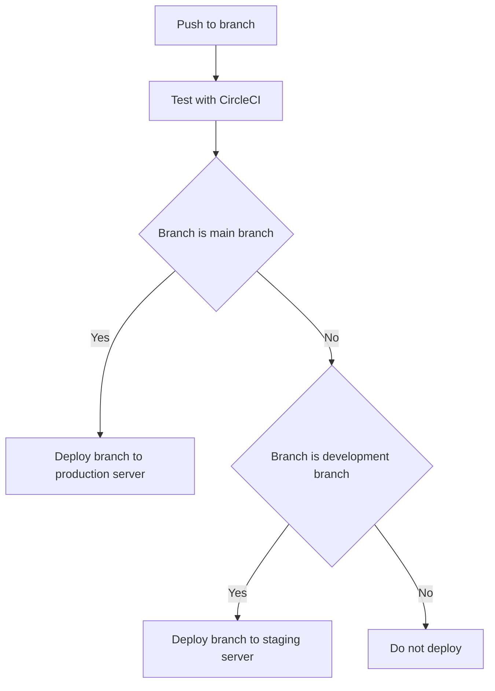

# Bureau Onbeperkte Zaken

This repository contains the "Bureau Onbeperkte Zaken" laravel project. This project is meant to compete with the current WordPress installation and serves as a means to create pages, upload projects and maintain information.

## Developer manual
### Installing
Before being able to contribute to this project, make sure to take the following steps. 
1. Install [PHP 8.x](https://www.php.net/downloads.php) and [composer](https://getcomposer.org/)
2. Clone this repository
3. Open the repository location in a terminal window
4. Run "composer install"
5. Copy ./.env.example to ./.env
6. Run "php artisan key:generate"
7. Run "php serve"

### Updating
Updating your project is as easy as pulling all new changes from the remote branch, and then updating composer with "composer update".

## CI/CD
All branches are tested after every push to guarantee a working version of the project. Without passing tests the branch will not be able to be pulled into development or main.

## Contributing
Contributions to this project are only done by the following users. Make sure to write tests, and test your branch thoroughly.
| Name | Student number |
|---|---|
| Roël Couwenberg | 2165296 |
| Kjell Geerlings | 2167089 |
| Ray Nelemans | 2155127 |
| Devon Thomassen | 2168516 |
| Jente van der Hoek | 2161933 |
| Sven van der Zwet | 2165077 |
